<p align="center">
  
</p>

<h1 align="center">RefVault</h1>

<p align="center">
  The local-first design reference vault for Mac.<br />
  Drop a screenshot. <b>Gemma 4 26B</b> tags it. Search it later by sentence.<br />
  <sub>It organizes your UI inspiration while you're busy looking for it — just take a screenshot, RefVault handles the rest.</sub>
</p>

<p align="center">
  <a href="https://github.com/Krsatvik1/RefVault/releases/latest"><b>↓ Download for macOS</b></a>
  &nbsp;·&nbsp; Apple Silicon &nbsp;·&nbsp; macOS 13+ &nbsp;·&nbsp; Free
</p>

---

<p align="center">
  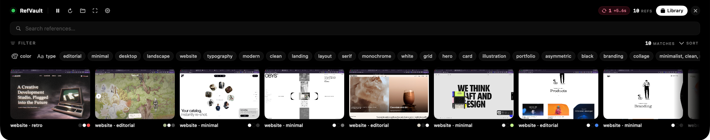
</p>

## Demo

<video src="https://github.com/Krsatvik1/RefVault/raw/main/docs/gemma-demo_2.mp4" controls width="100%"></video>

If the video doesn't play inline, [open it directly](docs/gemma-demo_2.mp4).

---

## Why I built this

I'm a designer. I'm constantly going through websites for inspiration — bookmarking pages, saving Pinterest pins, screenshotting Dribbble shots and landing pages I want to come back to. By the time I actually need that reference for a project, none of it is where I left it. The bookmark is in the wrong browser. The Pinterest board got reorganized. The screenshot is buried on my Desktop with a useless name like `Screenshot 2026-05-08 at 4.24.26 AM.png`.

RefVault is the thing I built so I'd stop losing references. Take a screenshot — that's it. Gemma 4 26B reads it locally, tags it, files it. When I'm searching weeks later for *"minimal pricing serif"* or *"i want some illustration references"*, the screenshot is right there.

## What it does

You point RefVault at a folder. By default it watches **`~/Desktop`** — where macOS drops every Cmd-Shift-4 screenshot — but you can add any folder you want.

Every time a screenshot lands there, **Gemma 4 26B** reads the image and pulls out everything that matters about a design reference: palette, typography, mood, layout, tags, and the URL on screen if it's a browser shot. Then it shows up in your library, tagged, ready to find again.

It runs entirely on your Mac. Nothing leaves the machine.

## Search by sentence, not tags

The search bar takes a real sentence. Gemma rewrites it into a structured query and runs it against your local library.

<table>
  <tr>
    <td>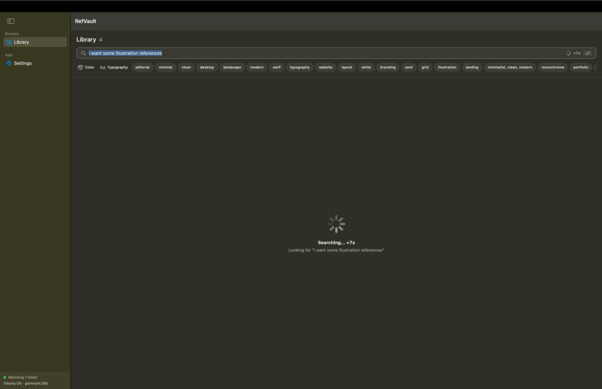</td>
    <td>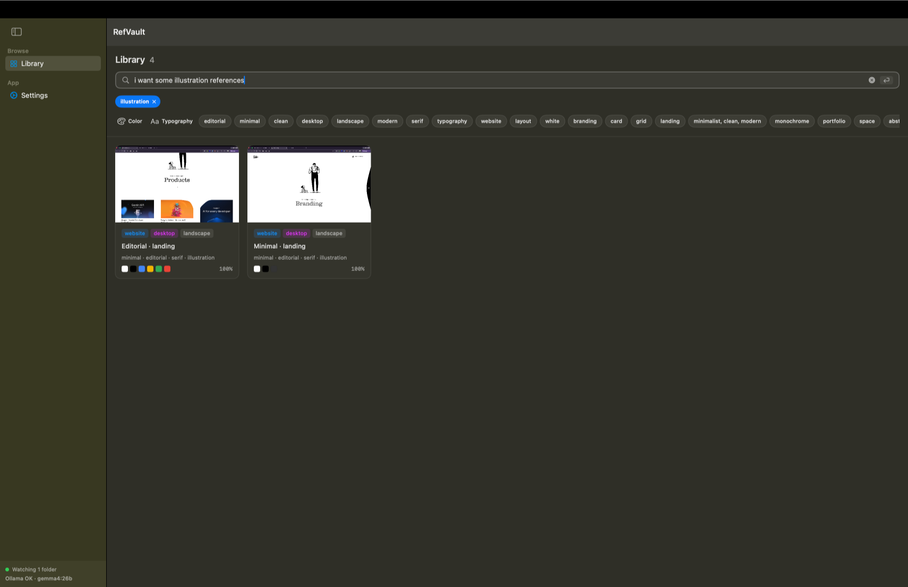</td>
  </tr>
  <tr>
    <td align="center"><i>Type what you actually mean…</i></td>
    <td align="center"><i>…and the library narrows down to it.</i></td>
  </tr>
</table>

## Saves stay out of the way

A toast slides in when something's saved. If you've already got that screenshot, it asks before duping. If something gets re-indexed, you see that too.

<video src="https://github.com/Krsatvik1/RefVault/raw/main/docs/dynamicIsland.mp4" controls width="100%"></video>

<table>
  <tr>
    <td>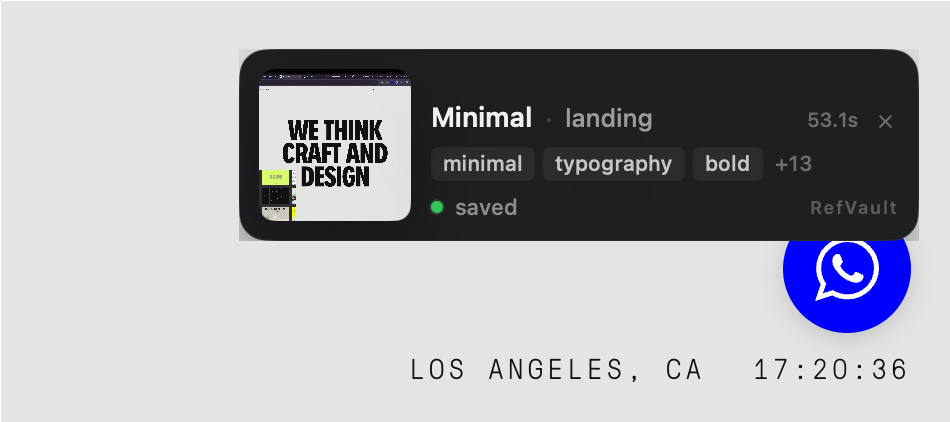</td>
    <td>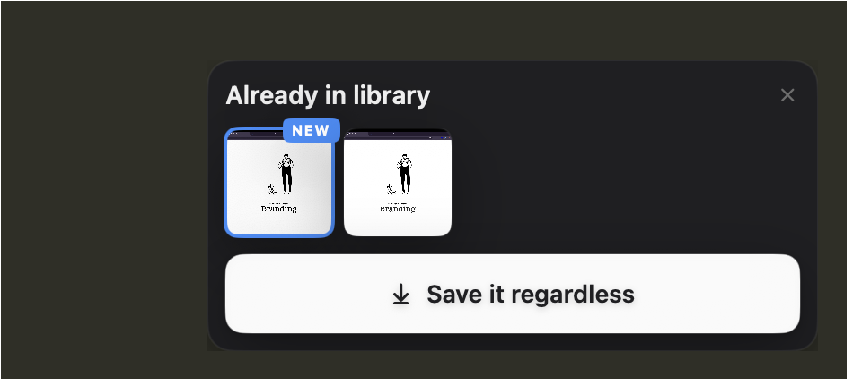</td>
    <td>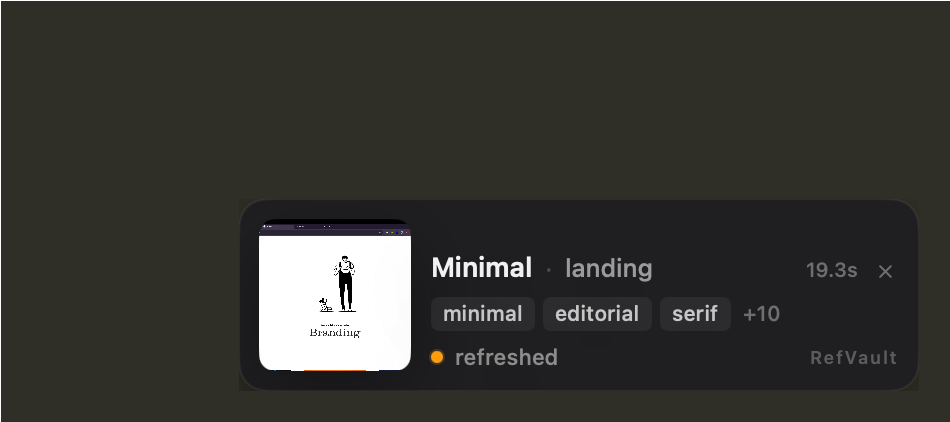</td>
  </tr>
  <tr>
    <td align="center"><sub>Saved · with palette and tags</sub></td>
    <td align="center"><sub>Already in library</sub></td>
    <td align="center"><sub>Refreshed</sub></td>
  </tr>
</table>

## Tune the way it sees

Raise or lower the relevance threshold (false positives vs. missed references), pick which folders RefVault watches, and reveal the library folder in Finder.

<p align="center">
  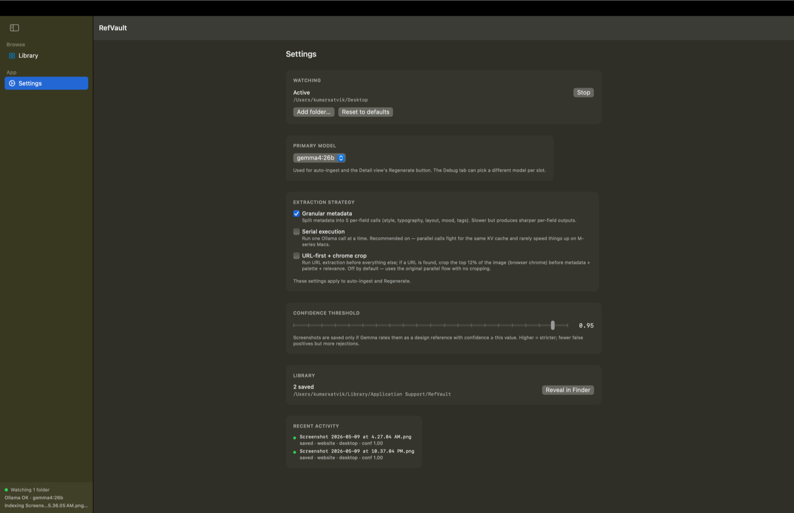
</p>

---

## Install

<p align="center">
  <a href="https://github.com/Krsatvik1/RefVault/releases/latest"><b>↓ Download RefVault.zip</b></a>
</p>

1. Download the `.zip` from the link above. Safari auto-extracts; other browsers — double-click.
2. Drag **RefVault.app** into `/Applications`.
3. First launch will be **blocked**: macOS shows *"Apple could not verify…"*. Click **Done**.
4. Open **System Settings → Privacy & Security**, scroll to Security, click **Open Anyway** next to the RefVault notice.

<p align="center">
  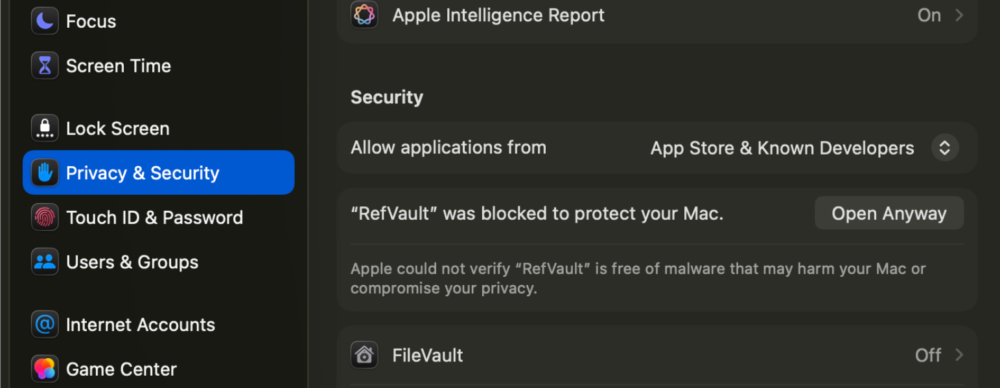
</p>

5. Re-launch from `/Applications`, click **Open** on the confirmation dialog.
6. The app downloads **Gemma 4 26B** (~15 GB) the first time. One-time, with progress.

<p align="center">
  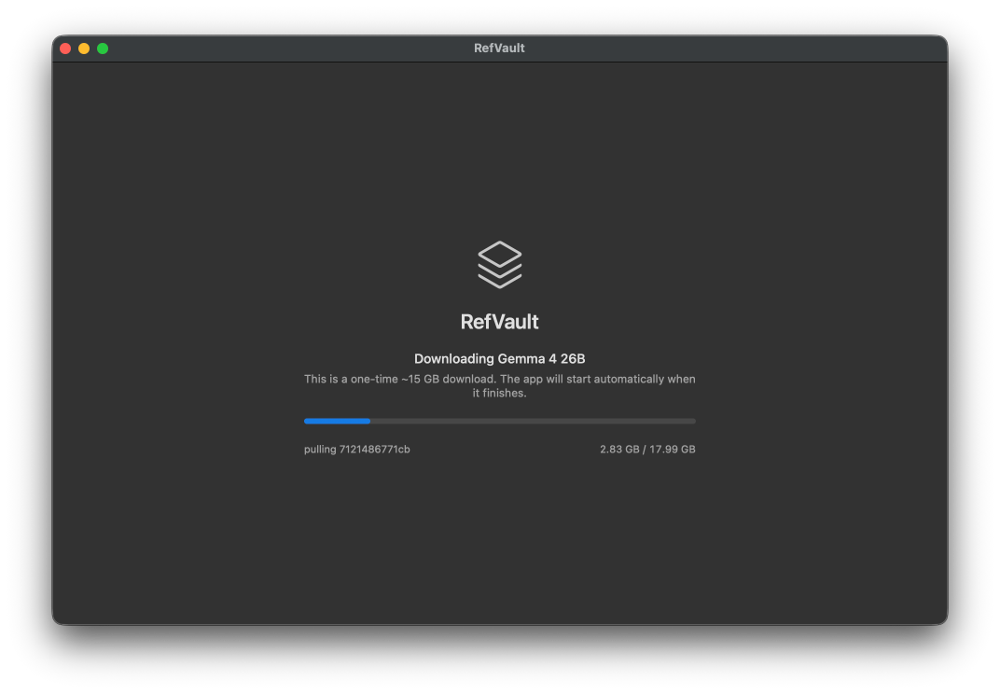
</p>

That's it. Ollama runtime + the Gemma 4 26B model are managed inside the app — no `brew install`, no `ollama pull`, no terminal.

> **Why "Open Anyway"?** I don't have an Apple Developer account yet ($99/yr), so RefVault is signed ad-hoc instead of with a paid Developer ID. Gatekeeper flags any ad-hoc-signed app on first launch. The "Open Anyway" exception is granted once per install and persists across re-launches.

### Reset the install (for re-testing the Gatekeeper flow)

If you want to capture fresh screenshots of the Privacy & Security flow, or hand the `.zip` to someone else from a clean state:

```bash
# 1. Quit RefVault
pkill -x RefVault

# 2. Forget the per-app Gatekeeper exception
sudo spctl --remove --type execute /Applications/RefVault.app

# 3. Remove the install
rm -rf /Applications/RefVault.app

# 4. Clear the LaunchServices cache
/System/Library/Frameworks/CoreServices.framework/Frameworks/LaunchServices.framework/Support/lsregister \
    -r -domain local -domain user
```

Re-download the `.zip`. Safari attaches `com.apple.quarantine` to the download; the next launch will hit the Gatekeeper block again.

### `xattr` cheatsheet

```bash
# Inspect quarantine state on an .app
xattr -l /Applications/RefVault.app

# Re-attach quarantine to simulate a "fresh download" without re-downloading
xattr -w com.apple.quarantine \
    "0181;$(printf '%x' $(date +%s));Safari;" \
    /Applications/RefVault.app

# Strip quarantine from a build you trust (skips the Gatekeeper prompt)
xattr -dr com.apple.quarantine /Applications/RefVault.app

# Strip the metadata `codesign` refuses to seal around (used by build.sh)
xattr -cr /path/to/something
```

The quarantine value format is `<flags>;<timestamp_hex>;<agent>;<uuid?>` — the value above marks the bundle as just-downloaded by Safari.

---

## How RefVault uses Gemma 4 26B

Every save runs through **Gemma 4 26B** locally via a bundled Ollama runtime. The 26B MoE variant runs cleanly on M-series Macs. Search uses the same model: a short prompt rewrites your sentence into a structured filter, then the local SQLite library does the rest.

Nothing leaves your Mac.

### Parallel + granular extraction

Instead of one mega-prompt asking Gemma "tell me everything about this image," RefVault splits the job into focused, **independent calls** — one for palette, one for typography, one for mood, one for layout, one for tags, one for the visible URL — and runs them **in parallel**. Each prompt is small and specific, which keeps Gemma honest (it can't shortcut a sub-task by giving up on just that one), and the parallel calls share Ollama's warm KV cache so total wall-clock time barely grows.

I A/B'd this against a single combined prompt and a serial-granular variant inside the in-app Debug view:

<p align="center">
  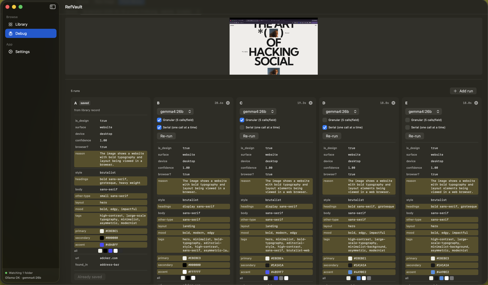
</p>

The parallel + granular pipeline produced consistently sharper per-field outputs than a single combined call, with comparable wall-clock time on the M4.

### Why 26B, not 4B

Earlier builds ran on `gemma4:e4b` for speed. It's faster, but palette, typography, and mood came back wrong often enough that the library got noisy. The 26B variant produces tags I trust on the first read.

<p align="center">
  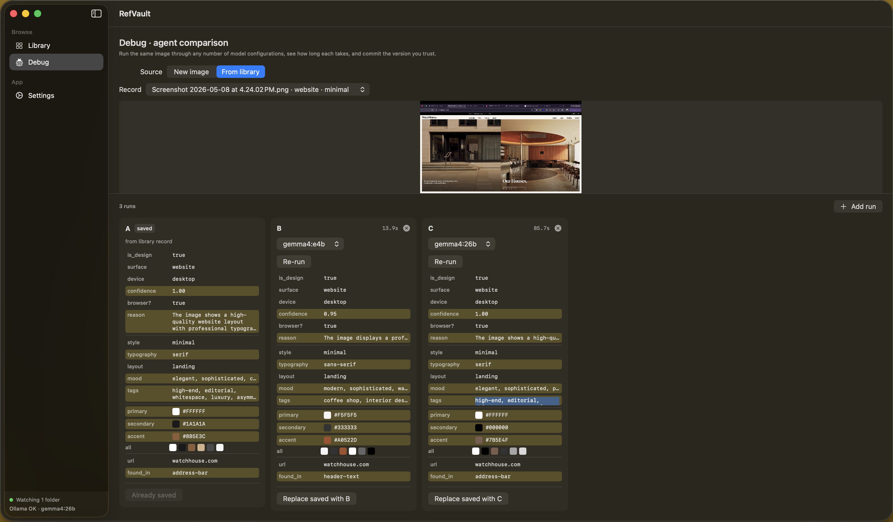
</p>

Same image, same prompts. The 26B output recognizes "high-end, editorial" mood and richer layout language ("modern, sophisticated, large-scale-typography, monochromatic, asymmetric, minimalist") where the 4B variant returns thinner, generic tags. Indexing happens once in the background, so model size matters more than raw speed for this use case.

### Performance

Tested on a **MacBook Air M4 with 24 GB RAM**:

- **Indexing:** ~60–100 seconds per screenshot (one-time, in the background)
- **Search:** ~20 seconds per query (one Gemma call to parse the sentence, then a local SQLite hit)

Both scale with model size and chip — bigger Macs go faster.

---

<details>
<summary><b>Build from source</b></summary>

```bash
git clone https://github.com/Krsatvik1/RefVault.git
cd RefVault
./scripts/build.sh        # → dist/RefVault.zip
```

For a dev session against a `swift run` build:

```bash
ollama serve              # in another terminal
ollama pull gemma4:26b
swift run RefVault
```

The dev build talks to Ollama on `:11434`; the packaged `.app` spawns its own daemon on `:11535` so it doesn't fight a system Ollama.

CI on push to `main` rebuilds the rolling [`latest`](https://github.com/Krsatvik1/RefVault/releases/latest) release — see [`.github/workflows/release.yml`](.github/workflows/release.yml).

</details>

---

<p align="center">
  Created for <a href="https://dev.to/devteam/join-the-gemma-4-challenge-3000-prize-pool-for-ten-winners-23in"><b>Google's Gemma 4 Challenge</b> on dev.to</a>.<br />
  <sub>MIT · made with care on a MacBook Air M4</sub>
</p>
